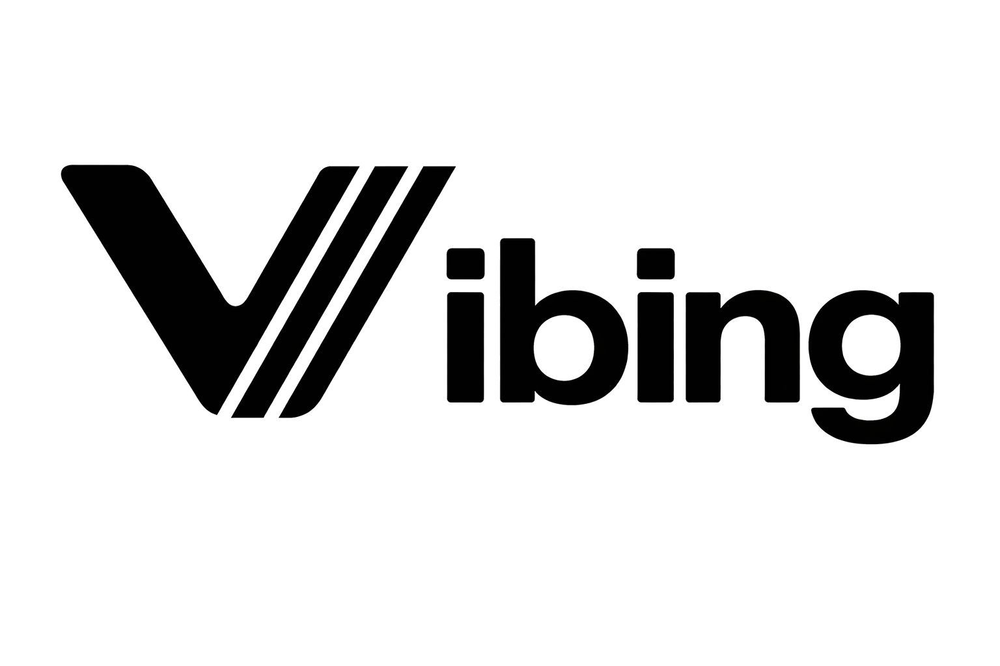
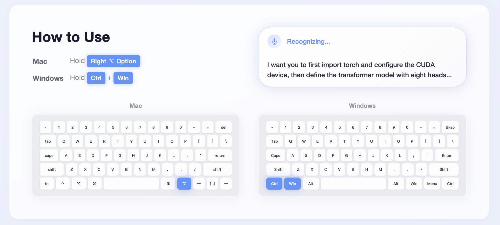

---

## Video Introduction

https://github.com/user-attachments/assets/db0bb23f-ae06-4135-a66a-1ff1669f4f84

## How to Use

  

## Key Features

- **Long-Form Voice Input** — Over 5 minutes of continuous speech in a single recording.
- **Personalized Hotwords** — Custom vocabulary for names, jargon, and domain-specific terms.
- **Context-Aware Intent Understanding** — Understands what you mean, not just what you say.
- **Multilingual** — Speak in any of 50+ languages with automatic detection.
- **Mixed-Language Input** — Switch between languages freely within a single sentence.
- **LLM-Powered Rewriting** — AI rewrites your speech into polished, context-appropriate text.
- **Translation** — Real-time voice translation across languages.

## Download Vibing

| Version | macOS | Windows |
|---------|-------|---------|
| v0.1.0 | Coming soon | [Download (.exe)](https://github.com/VibingJustSpeakIt/Vibing/releases/download/v0.1.0/Vibing-v0.1.0-windows.exe) |
